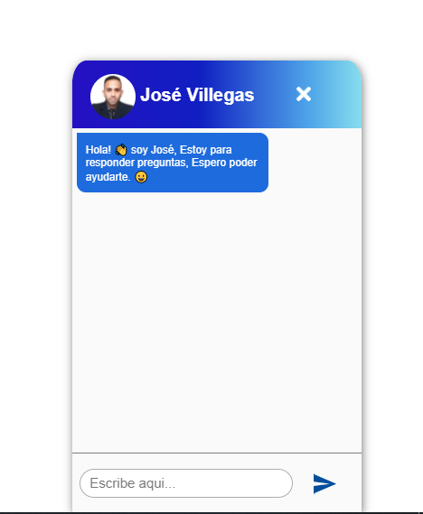

# Chat-Bot

## Descripción 📋

El Proyecto es un en **Chat Bot** simple que responde varias preguntas. Esto se programó mediante el uso de **Expresiones Eegulares** en **JavaScript**.

## Herramientas 🛠️

* [Visual Studio](https://visualstudio.microsoft.com/es/) - IDE
* [JSON](https://www.ibm.com/docs/es/baw/20.x?topic=formats-javascript-object-notation-json-format) - Data
* [Git](https://git-scm.com/) - Control de Versiones
* [Regex](https://developer.mozilla.org/es/docs/Web/JavaScript/Guide/Regular_Expressions) - Expresiones Regulares

### Chat Bot - [Pruébalo aquí..](https://chatbotjose.netlify.app/)
